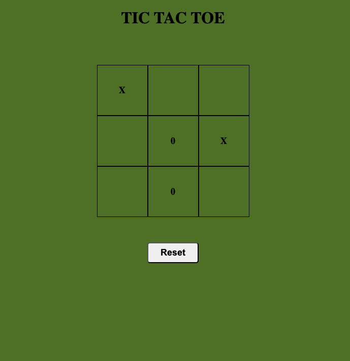
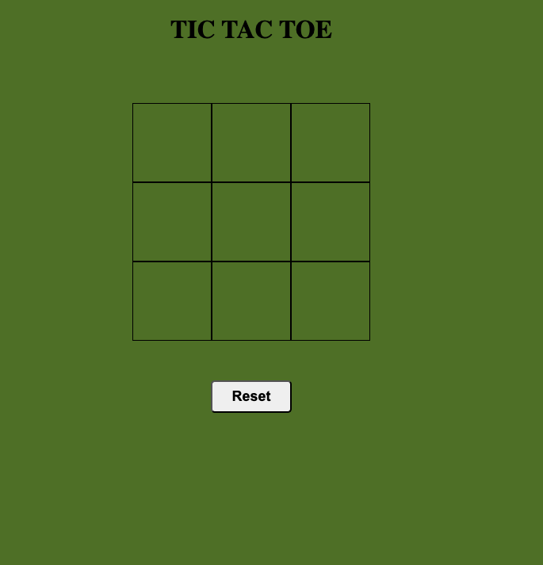
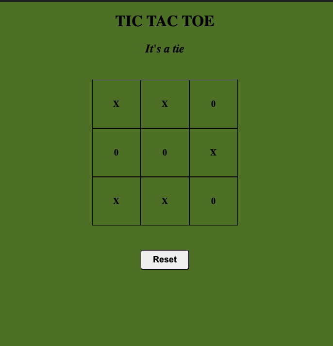

# Tic-Tac-Toe Game
 
This is a Tic Tac Toe game with Javascript, HTML and CSS

## Features
- Two-Player Mode: Players take turns to play as "X" and "O".
- Win Detection: The game checks for a win after each turn.
- Draw Detection: If all cells are filled without a winner, the game declares a draw.
- Restart Option: Players can restart the game after a win or draw.

## Installation
Git clone

```bash
    git clone https://github.com/shivanisharma19/tic-tac-toe.git
    cd tic-tac-toe-js/src
    open index.html
```
Run index.html on browser


## Code Structure
- HTML (index.html): Defines the structure of the game, including the grid and restart button.
- CSS (style.css): Provides styling for the game, including the layout of the grid and appearance of the game cells.
- JavaScript (index.js): Contains the game logic, including player turns, win detection, and resetting the game.

## Screenshots

1. General
    
    

1. Winner
    
    

1. Tie
    
    
